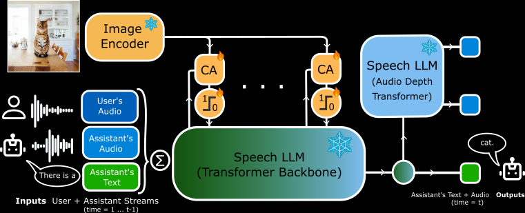

# M👁️shiVis: Teaching Speech Models to Converse about Images


[[Preprint]][moshi-vision-arxiv] [[Demo]][talk-to-moshivis] [[Models on Hugging Face]](https://huggingface.co/collections/kyutai/)


MoshiVis is a **Vision Speech Model** (VSM) directly building on the speech-text foundation model [Moshi][moshi-arxiv] and augmenting it with the ability to freely discuss about an image while maintaining its natural conversation style and low latency. In total, MoshiVis adds $\sim$ 206M adapters parameters on top of the 7B Moshi and a pretrained frozen 400M PaliGemma2 vision encoder.

 This repository currently contains inference code to run your own MoshiVis server supporting three different backends via a webUI frontend. We are also planning to release training/finetuning code in the future.
For more information about our speech codec Mimi and speech model Moshi, please visit the original [Moshi repo][moshi-github].
For more technical details on MoshiVis, see our [blog post][blog] and [preprint][moshi-vision-arxiv].

[Talk to MoshiVis][talk-to-moshivis] now on our live demo !

<p align="center">
</p>


To inject visual inputs in the stream of *speech tokens* from Moshi, we extend the core transformer with a **cross-attention mechanism** to infuse visual information into the speech tokens stream. To maintain Moshi's **low-latency** and reduce memory usage, the cross-attention projection weights are shared **across layers.**
Moreover, to ensure that Moshi’s original conversational abilities are not lost in the process, the cross-attention modules  feature a gating mechanism that allows the model to modulate the visual input stream at will.


For more details on MoshiVis, including our training pipeline, synthetic data generation pipeline, and ablation experiments on the gating mechanism see our [preprint][moshi-vision-arxiv].


## Model Release
We release MoshikaVis, based on the original Moshika  (*female voice*)  checkpoints from Moshi's open-source release. For the image embedding part, we rely on publicly available off-the-shelf image-text encoders: The checkpoints we release use the frozen weights of a vision encoder from the [PaliGemma2](https://arxiv.org/abs/2412.03555) family, specifically on the weights provided at [huggingface](https://huggingface.co/google/paligemma2-3b-pt-448). Note that for convenience, each MoshiVis checkpoint contains the full model: i.e., the vision adaptation modules weights are bundled together with the weights of Mimi (speech codec), the Helium text tokenizer, image encoder, and base Moshi model.

For each model, we release several variants compatible with three different backends and quantization formats. Further instructions for each backend can be found below.

| Backend | Moshi**ka** |
| ------- | ----------- |
| [PyTorch](#pytorch-backend) |  [BF16](https://huggingface.co/kyutai/moshika-vis-pytorch-bf16)  |
| [Rust](#rust-backend) |  [BF16](https://huggingface.co/kyutai/moshika-vis-candle-bf16) [Q8_0](https://huggingface.co/kyutai/moshika-vis-candle-q8)  |
| [MLX](#mlx-backend) |  [BF16](https://huggingface.co/kyutai/moshika-vis-mlx-bf16)   |


All model weights (*excluding the bundled vision encoder*) are released under the CC-BY 4.0 license; The bundled vision encoder (*PaliGemma2's vision encoder*) is released under the [Gemma license](https://ai.google.dev/gemma/terms).


## Organisation of the Repository

For the **frontend**, we recommend using the provided web UI as it allows for additional echo cancellation that helps
the overall model quality. To obtain the client, you can either **(i)** build it yourself from the sources in [`client`](client/) as [described here](#building-the-frontend) or **(ii)** download the pre-built static
version we provide:

```bash
# Download prebuilt client sources
# option 1: using uv dependency manager
uv run scripts/get_static_client.py

# OR option 2: with pip
pip install fire rich huggingface_hub
python scripts/get_static_client.py
```

Most commands below will serve this UI by default using the `https` protocol (see more info [here](#http-vs-https)). To connect via `https`, you will need to generate SSL certificates first, as follows:

```bash
# Generate the SSL certificates in the root directory
openssl req -x509 -nodes -days 365 -newkey rsa:2048 -keyout key.pem -out cert.pem
```

We provide three different  **backends** for the MoshiVis inference stack in this repo. While we hope that the present codebase will work on Windows, we do not provide official support for it.
- A [PyTorch](#pytorch-backend) version in the [`kyuteye_pt`](kyuteye_pt) directory.
- A [Rust](#rust-backend) version (as used in the online demo) is in the [`kyuteye_rs`](kyuteye_rs/) directory.
- A [MLX](#mlx-backend) version (tested on a MacBook Pro M3) is in the [`kyuteye_mlx`](kyuteye_mlx/) directory


For the PyTorch and MLX backends, we recommend using [uv](https://docs.astral.sh/uv/) to setup and run the code,
as it will manage all dependencies for you transparently.

`uv` is provided as a lightweight binary and can be installed as:
```bash
curl -LsSf https://astral.sh/uv/install.sh | sh
```


### PyTorch Backend
 > Note: At the moment, we do not support quantization
 > for the PyTorch version, so you will need a GPU with a significant amount of memory ($\sim$ 24GB).

You can start the MoshiVis PyTorch server with the following command and then access the web UI on [https://localhost:8008](http://localhost:8008)

```bash
cd kyuteye_pt
uv run server configs/moshika-vis.yaml --port 8088
```

Note that if your GPU is on a distant machine, you may need to forward the remote 8088 port to your localhost using ssh `-L` flag. Then connects to [https://localhost:8088](https://localhost:8088) as mentionned previously.


### Rust Backend
> For the Rust backend, you will need a recent version of the [Rust toolchain](https://rustup.rs/).
> To compile GPU support, you will need a valid [CUDA](https://developer.nvidia.com/cuda-toolkit) installation, in particular with `nvcc`.

In order to run the Rust inference server, use the following command:

```bash
cd kyuteye_rs
cargo run --features cuda --bin moshi-backend -r -- --config configs/config-moshika-vis.json standalone --vis
```

When using macOS, you can replace `--features cuda` with `--features metal`.

Alternatively you can use `config-moshika-vis-q8.json` rather than `config-moshika-vis.json` to use the
quantized q8 model. You can also change some of the server options (e.g., starting port) in the json file directly.

Once the server has printed 'standalone worker listening', this means the model is ready.
By default the Rust server  will be accessible at [https://localhost:8088](https://localhost:8088).


### MLX Backend

We provide a MLX model checkpoint in `bfloat16` as well as quantized checkpoints
using `q4` and `q8`.

To start the MoshiVis MLX backend you can then run the following commands:

```bash
cd kyuteye_mlx
# In bfloat16 - weights will be downloaded from HF
uv run server

# In q4 - using local quantized weights
uv run server -q 4

# In q8 - using local quantized weights
uv run server -q 8

# In bfloat16 - using local weights
uv run server --moshi-weights model.safetensors

# In q4 - using local (quantized) weights
uv run server --moshi-weights model.safetensors -q 4
```

You can then access the web UI on [http://localhost:8008](http://localhost:8008)

### Frontends

#### WebUI

We recommend using the WebUI frontend as explained [here](#organisation-of-the-repository). If you want to build the sources yourself, follow these steps (further installation and build instructions can be found in the `client` directory):

**via NPM.**
```bash
cd client
npm install
npm run build
```

**via Docker.**  If you have `docker` installed, you can also build the client via

```bash
docker buildx bake client
```

After building the sources, the static dir for the web UI can then be found in the
`client/dist` directory, and  will be used as default for the different backend.

#### Rust Command Line

Alternatively, we also provide a command line interface for the Rust backend:


```bash
cd kyuteye_rs;
cargo run --bin moshi-cli -r -- tui --host localhost
```


## Troubleshooting

### http vs https
By default, the web UI server starts with the `https` protocol rather than `http`: Accessing a server that is not localhost via `http` may cause issues with using the microphone in the web UI (in some browsers this is only allowed using https). 

To use an `https` connection, you will first need to setup SSL certificates:

```bash
# Generate the SSL certificates in the root directory
openssl req -x509 -nodes -days 365 -newkey rsa:2048 -keyout key.pem -out cert.pem
```

Note that if you want to use a `http` connection instead you can:
  * For the PyTorch backend, add the flag `--ssl False`
  * For the MLX backend, `http` is the default and `https` can be used with `--ssl certdir` where `certdir` is the directory that contains the certificates.


Note that when using `https` you  may get warnings from the browser about the site being unsafe.
When using chrome for instance, you
can bypass these by selecting "Details" or "Advanced", then "Visit this unsafe
site" or "Proceed to localhost (unsafe)".


## License

The present code is provided under the MIT license for the Python parts, and Apache license for the Rust backend.
The web client code is provided under the MIT license.

The model weights (*excluding the vision encoder*) for the models are released under the CC-BY 4.0 license; the vision encoder is licensed under Apache 2.0.

All images displayed in the web UI are obtained under the free Unsplash license. For the precise list of image urls and authors, please refer to [this file](client/public/assets/images/demo/attribution.txt).

## Citation

If you use MoshiVis in your research, please cite our work:

```
@article{kyutai2025moshivis,
  author = {Am\'elie Royer and Moritz Böhle and Gabriel de Marmiesse and
  Laurent Mazar\'e and Alexandre D\'efossez and Neil Zeghidour and Patrick P\'erez},
  year = {2025},
  title = {Vision-Speech Models: Teaching Speech Models to Converse about Images},
  url = {https://github.com/kyutai-labs/moshivis/blob/main/assets/moshivis_arxiv.pdf},
}


@techreport{kyutai2024moshi,
      title={Moshi: a speech-text foundation model for real-time dialogue},
      author={Alexandre D\'efossez and Laurent Mazar\'e and Manu Orsini and
      Am\'elie Royer and Patrick P\'erez and Herv\'e J\'egou and Edouard Grave and Neil Zeghidour},
      year={2024},
      eprint={2410.00037},
      archivePrefix={arXiv},
      primaryClass={eess.AS},
      url={https://arxiv.org/abs/2410.00037},
}
```

[blog]: https://kyutai.org/2025/03/20/moshivis-blog.html
[moshi-vision-arxiv]: assets/moshivis_arxiv.pdf
[moshi-arxiv]: https://arxiv.org/abs/2410.00037
[moshi-github]: https://github.com/kyutai-labs/moshi/tree/main?tab=readme-ov-file#models
[talk-to-moshivis]: https://vis.moshi.chat
